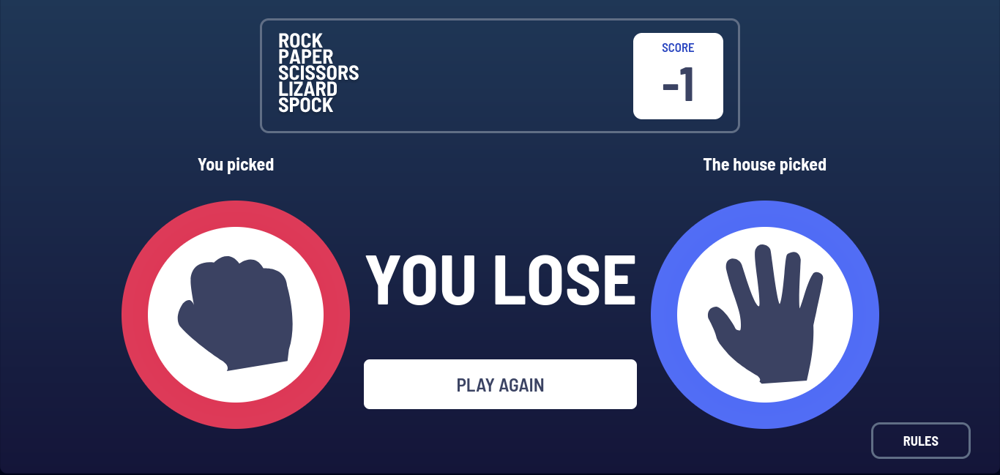
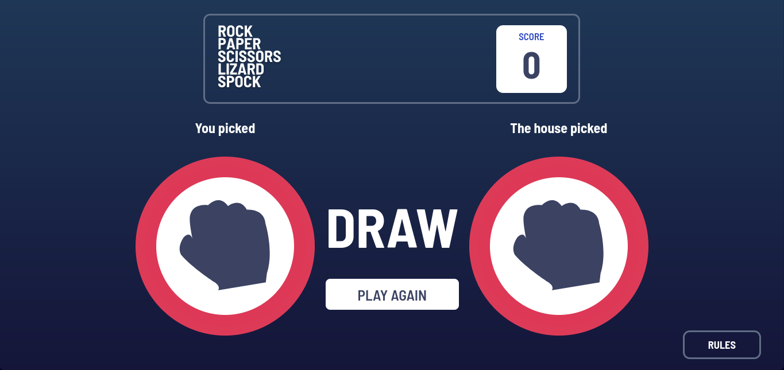
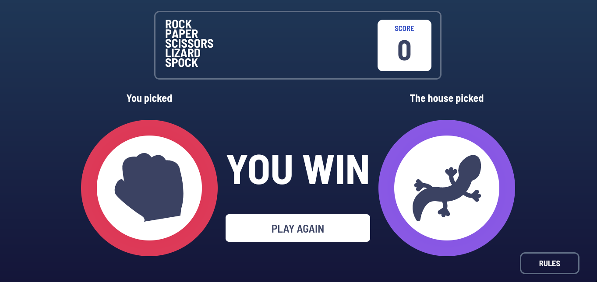
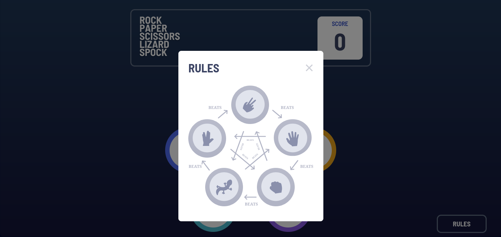

# Rock, Paper, Scissors, Spock, Lizard

This is a re implementation from the classic rock, paper, scissors; I got
the assets from [frontendmentor](https://www.frontendmentor.io/challenges/rock-paper-scissors-game-pTgwgvgH)
and this project is a vanilla JS implementation, check the [scr/util](./src/util) to see
the logic behind it.

## What is this?

This is an interactive game that keeps your score even when you leave the page!!,
it means that you can leave the game in any moment; it doesn't matter, every time
you get back It will show you your fails keeping what you did, so you can lose as
much as you can...

If you master the rules you can also draw as a pro

In some cases you'll win to give you a sensation of happiness

Come to chek the rules an play... Rock Paper Scissors Spock Lizard

# Check its deploy

I've been working on this and I liked what I got until now, it also should
without internet connection

This is also my first deploy to netlify and I love it <3

[Play here](https://rock-paper-sissors-spock-lizard.netlify.app/)
